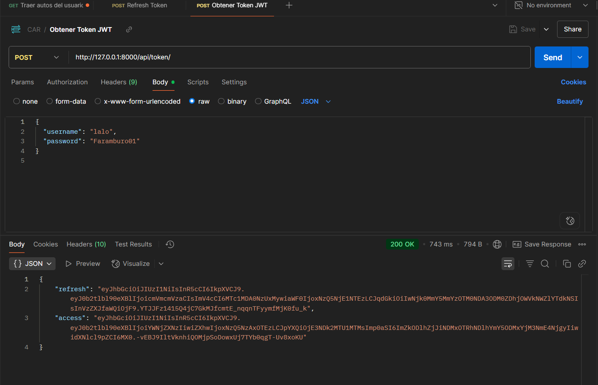
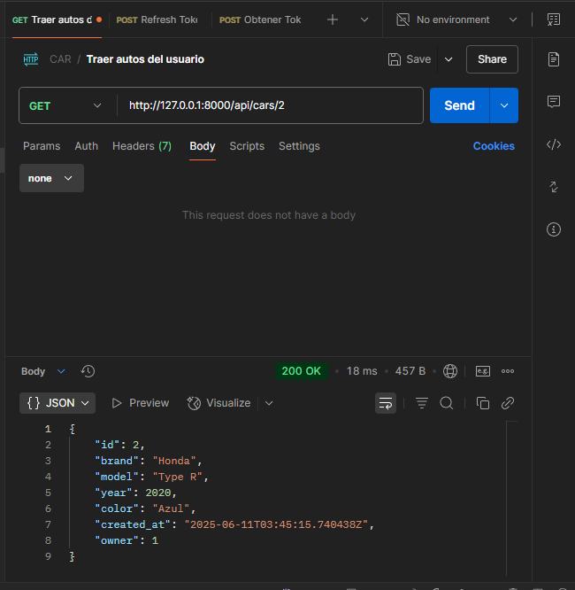

# Aseguramiento de una API REST con Django REST Framework

## 1. Introducción

Esta API permite gestionar autos mediante operaciones CRUD (Crear, Leer, Actualizar, Eliminar). La seguridad se implementa con autenticación JWT y permisos personalizados para proteger los datos y limitar el acceso.

---

## 2. Medidas de Seguridad Aplicadas

### Autenticación JWT

- Se usa la librería `djangorestframework-simplejwt`.
- Los usuarios deben autenticarse mediante el endpoint `/api/token/` para obtener el token.
- Las peticiones a `/api/cars/` y rutas relacionadas requieren enviar el token en el encabezado Authorization con el prefijo `Bearer`.

### Permisos personalizados

- Se aplicó el permiso `IsAuthenticated` para proteger los endpoints.
- Se creó un permiso personalizado que permite que solo el dueño del auto pueda modificar o eliminar el registro.
- Otros usuarios solo pueden obtener los datos (lectura).

### Protección contra acceso no autorizado

- Campos sensibles como `user` o `is_admin` no son editables desde el frontend ni por usuarios no autorizados.
- Rutas de modificación y eliminación están protegidas con permisos adecuados para evitar accesos indebidos.

### Validación y limpieza de datos

- Los serializers validan campos obligatorios (ejemplo: `brand`, `model`).
- Se previenen entradas maliciosas que puedan causar vulnerabilidades.

### Protección de claves y configuraciones sensibles

- Se usó `python-decouple` para cargar el `SECRET_KEY` y otras configuraciones desde un archivo `.env`.
- El archivo `.env` está excluido del control de versiones mediante `.gitignore`.

---

## 3. Capturas de Pantalla

- Solicitud de token JWT en Postman:  
  

- Acceso a `/api/cars/` con token válido:  
  

- OBTENER REFRESH TOKEN
(images\REFRESH-TOKEN.png)

---

## 4. Conclusión

Esta práctica me permitió implementar mecanismos de seguridad fundamentales en una API REST con Django REST Framework, como autenticación JWT, permisos personalizados, validación de datos y protección de configuraciones sensibles. Estas medidas fortalecen la seguridad y confiabilidad de la API.

---

## 5. Referencias

- [Django REST Framework - JWT Authentication](https://www.django-rest-framework.org/api-guide/authentication/#json-web-token-authentication)
- [python-decouple](https://github.com/henriquebastos/python-decouple)
- [Django Permissions](https://docs.djangoproject.com/en/5.2/topics/auth/default/#permissions-and-authorization)
